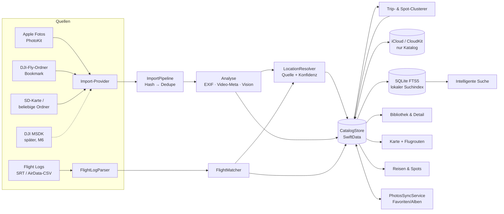

# FlightMate AI — Drone Media Explorer
## Architektur- und Produktkonzept (Stand 07/2026, zur Abstimmung)

> Status: **Entwurf zur Abstimmung mit dem Product Owner.**
> Es wird erst implementiert, wenn dieses Dokument abgenommen ist
> (offene Entscheidungen: siehe Kapitel 12).

---

## 1. Produktkonzept

### 1.1 Vision

FlightMate AI wächst von der Flugplanungs-App zum **persönlichen
Flug-, Foto- und Reisearchiv**: Alle Drohnenaufnahmen (Fotos, Videos,
bearbeitete Versionen) und alle Flüge werden dauerhaft organisiert,
intelligent verknüpft (Zeit, Ort, Flug, Reise, Spot) und komfortabel
durchsuchbar — auf iPhone, iPad und Mac mit demselben Datenbestand.

### 1.2 Unverhandelbare Grundprinzipien

1. **Originale sind unantastbar.** Die App verändert niemals eine
   Originaldatei. Alles — Verschlagwortung, Bewertungen, Orte,
   Verknüpfungen, Notizen — lebt ausschließlich im Katalog
   (Datenbank). Der Katalog referenziert Originale, er besitzt sie
   nicht zwingend (Referenz- vs. Bibliotheksmodus, Kap. 9).
2. **Erklärbare Intelligenz.** Automatische Zuordnungen (Video-Ort,
   Reise, Spot) tragen immer **Quelle + Vertrauensgrad** und sind
   manuell korrigierbar. Keine Blackbox — wie beim Flight Score.
3. **Lokal zuerst.** Analyse (EXIF, Video-Metadaten, Bildinhalte via
   Vision) läuft on-device. Kein Upload von Medien zu Dritten.
4. **Ehrliche Grenzen.** Was iOS/DJI nicht hergeben (z. B. echte
   Hintergrund-Ordnerüberwachung, verschlüsselte DJI-TXT-Logs),
   wird als Grenze benannt statt vorgetäuscht.
5. **Modular & offen.** Import und Analyse laufen über
   Provider-Protokolle, damit später Autel, Skydio, HoverAir, Canon,
   Sony, Nikon und Smartphones andocken können (Kap. 11).

### 1.3 Abgrenzung (bewusst NICHT im Umfang)

- Kein Videoschnitt, keine Bildbearbeitung (nur Verwaltung/Verknüpfung).
- Kein Cloud-Dienst von FlightMate — Sync bleibt in Apples
  Nutzer-iCloud (PRD Kap. 11 gilt weiter).
- Kein Social/Sharing-Feed (PRD N2 gilt weiter).

### 1.4 Ehrliche Plattform-Realitäten (Grundlage aller Entscheidungen)

| Wunsch | Realität auf iOS/iPadOS/macOS | Konsequenz |
|---|---|---|
| Direkter DJI-Import | DJI Mobile SDK v5 existiert, verlangt aber App-Registrierung bei DJI, unterstützt nur bestimmte Modelle und macht die App wartungsintensiv. Für Consumer-Drohnen (Mini-Serie) ist der praktikable Weg die DJI-Fly-Ablage. | MSDK = spätere Ausbaustufe (Roadmap M6), nicht MVP. |
| Import aus DJI Fly | DJI Fly legt Medien im app-eigenen Ordner ab, der über die Dateien-App erreichbar ist („Auf meinem iPhone → DJI Fly“). Per Ordner-Auswahl (Security-Scoped Bookmark) kann FlightMate diesen Ordner dauerhaft lesen. | Realistischer Weg 2 — als geführter „DJI-Fly-Ordner verbinden“-Assistent. |
| Auto-Erkennung neuer Medien | iOS erlaubt **keine** echte Hintergrund-Ordnerüberwachung durch Dritt-Apps. Möglich: Scan beim App-Start/Vordergrund + BGAppRefresh-Gelegenheitsscan + PhotoKit-Änderungsbenachrichtigungen (nur für Apple Fotos). | „Automatisch“ heißt ehrlich: bei jedem Öffnen sofort, im Hintergrund gelegentlich. |
| SD-Karte | USB-C/Lightning-Kartenleser erscheinen in der Dateien-App als externes Volume; Zugriff über den Dokument-Picker, auf dem Mac direkt. | Weg 4 funktioniert auf allen drei Plattformen über dieselbe Ordner-Import-Schiene. |
| DJI Flight Logs | `.SRT` (Video-Telemetrie) und AirData-CSV sind lesbar (bereits implementiert). Die verschlüsselten DJI-Fly-`.TXT`-Logs sind ohne DJI-Schlüssel **nicht** lesbar — ehrliche Grenze bleibt. | Flugrouten kommen aus SRT (pro Video sogar als Route!) und AirData-CSV. |
| Ein Datenbestand auf 3 Geräten | SwiftData + CloudKit synchronisiert den **Katalog** zuverlässig. Die **Medien selbst** (GBs) synchronisiert man nicht über CloudKit-Records — Optionen in Kap. 9. | Katalog immer synchron; Medienverfügbarkeit je Gerät transparent anzeigen. |
| Lokale KI-Suche | Vision liefert on-device Szenen-Klassifikation (Wasserfall, Sonnenuntergang, See, Strand …), Feature-Prints für Ähnlichkeit. Freitext wird über einen deterministischen Query-Parser auf Tags/Ort/Zeit abgebildet. | „Zeige alle Wasserfälle“ funktioniert lokal; kein LLM nötig (optional später). |
| Apple-Fotos-Abgleich | PhotoKit erlaubt Lesen + Änderungsabos, Favoriten setzen und Alben pflegen (mit Nutzer-Erlaubnis). Ein „Bewertungs“-Feld (Sterne) kennt Apple Fotos nicht — nur Favorit ja/nein. | Sync-Umfang ehrlich: Favoriten + Alben, keine Sterne. |

---

## 2. Modulübersicht

Die App wird in Swift-Packages/Targets geschnitten; die bestehende
FlightMate-Funktionalität bleibt unangetastet und wird zum Modul
„Planung“.

```
FlightMate (App-Targets: iOS / iPadOS / macOS)
│
├── FMPlanung        bestehende App: Score, Legal, Spots, Entdecken,
│                    Logbuch (wird Datenquelle fürs Archiv)
│
├── FMKatalog        SwiftData-Modelle, Katalog-Store, CloudKit-Sync,
│                    Dedupe, Bookmarks (KEINE UI)
│
├── FMImport         Import-Provider (Protokoll) + konkrete Provider:
│                    PhotosProvider, FolderProvider (DJI Fly, SD,
│                    beliebige Ordner), später DJIMSDKProvider
│
├── FMAnalyse        EXIF/Video-Metadaten (ImageIO/AVFoundation),
│                    Vision-Tagging, Standort-Ermittlung (Kaskade),
│                    Reise-/Spot-Clustering, Flightlog-Matching
│
├── FMKarte          Medien-Karte (Cluster-Marker mit Vorschau),
│                    Flugrouten-Darstellung & -Animation
│
├── FMSuche          Index (SQLite FTS5) + Query-Parser
│                    („wasserfall in kanada 2026“ → Filter)
│
└── FMArchivUI       Bibliothek, Reisen, Spots, Detailansichten,
                    Versionen-Verwaltung, Import-Assistenten
```

**Abhängigkeitsregel:** UI-Module kennen Stores, Stores kennen
Provider-Protokolle — nie umgekehrt. Kein Modul außer FMKatalog
schreibt in die Datenbank.

---

## 3. Datenmodell (SwiftData, CloudKit-fähig)

Kernidee: **Ein `MediaAsset` pro Originaldatei**, identifiziert über
einen Inhalts-Fingerabdruck. Alles andere hängt daran.

```
MediaAsset                          ← EIN Datensatz je Original
├─ id: UUID
├─ contentHash: String              SHA-256 (Dedupe-Anker, Kap. 8)
├─ kind: photo | video
├─ capturedAt: Date  (+ timeZone)
├─ importedAt: Date
├─ source: MediaSourceRef           woher (Provider-ID + Detail)
├─ files: [FileRef]                 wo liegt das Original (je Gerät!)
├─ photoMeta: PhotoMeta?            1:1
├─ videoMeta: VideoMeta?            1:1
├─ location: LocationFix?           1:1 (mit Quelle + Konfidenz)
├─ aiTags: [AITag]                  n:m (Vision-Szenen, Konfidenz)
├─ userTags: [String]
├─ favorite: Bool, rating: Int?     nur im Katalog, nie in der Datei
├─ notes: String
├─ flight: Flight?                  n:1
├─ spot: MediaSpot?                 n:1
├─ trip: Trip?                      n:1
├─ versions: [EditedVersion]        1:n
└─ photosAssetID: String?           PHAsset.localIdentifier (Abgleich)

FileRef                             Original-Fundorte (Referenzmodus)
├─ deviceID: String                 welches Gerät sieht diese Datei
├─ bookmark: Data                   Security-Scoped Bookmark / Pfad
├─ fileSize: Int64, fileName: String
└─ availability: online | offline | missing

PhotoMeta      GPS, Kamera-/Drohnenmodell, ISO, Belichtungszeit,
               Blende, Brennweite (mm + 35-mm-Äquivalent),
               Blickrichtung (GPSImgDirection), absolute/relative
               Höhe, Gimbal-Winkel (XMP drone-dji), Abmessungen,
               rawExif: [String: String]   ← ALLES Übrige, verlustfrei

VideoMeta      Dauer, Auflösung, Bildrate, Codec (HEVC/H.264/…),
               HDR-Format (HLG/HDR10/Dolby Vision), Farbraum +
               D-Log-Erkennung (Heuristik: Farbprimaries/Metadaten/
               Dateiname — als „vermutet“ gekennzeichnet),
               Kamera-/Drohnenmodell (QuickTime-Metadaten),
               Dateigröße, rawMetadata: [String: String]

LocationFix                         Standort MIT Herkunft (Prinzip 2)
├─ coordinate, altitudeM?
├─ sourceKind: exif | flightlog | neighborPhoto | manual | spotDefault
├─ confidence: high | medium | low
└─ derivedFromAssetID? / flightID?  Beleg der Herleitung

Flight                              ein realer Flug
├─ start/end: Date, homePoint?
├─ track: [TrackPoint]              t, lat, lon, altM, speedMS?, heading?
├─ sourceFile: FileRef              SRT / AirData-CSV
├─ maxAltM, maxDistanceM, durationS
├─ logbookEntryID: UUID?            Brücke zum bestehenden Logbuch
└─ assets: [MediaAsset]             zeitlich zugeordnete Medien

Trip                                automatisch erkannte Reise
├─ name (auto: „Ontario, Juli 2026“ — editierbar), start/end
├─ regionSummary (Geocoding), isManuallyEdited: Bool
└─ spots: [MediaSpot], flights: [Flight], assets: [MediaAsset]

MediaSpot                           verdichteter Foto-Ort
├─ name (auto: Geocoding/naher FlightMate-Spot — editierbar)
├─ center, radiusM
├─ description, rating: Int?, notes
├─ firstVisit, lastVisit            (berechnet, gespeichert)
├─ linkedPlanningSpotID: UUID?      Brücke zu den Planungs-Spots
└─ assets: [MediaAsset]

EditedVersion                       bearbeitete Fassung eines Originals
├─ purpose: String                  „YouTube“, „Instagram“, „Familienfilm“…
├─ fileRef: FileRef?  ODER url: URL (z. B. YouTube-Link)
├─ createdAt, notes
└─ original: MediaAsset             n:1 — Verknüpfung bleibt dauerhaft

AITag          label (en) + labelDE, confidence, source: vision|user
```

**Warum SwiftData (+ SQLite-FTS daneben):** SwiftData liefert die
CloudKit-Synchronisation des Katalogs praktisch geschenkt und passt
zu SwiftUI. Für die Volltext-/Facettensuche wird zusätzlich ein
lokaler **SQLite-FTS5-Index** gepflegt (abgeleitet, jederzeit neu
aufbaubar — er ist bewusst NICHT Teil des Syncs). Beste Werkzeuge je
Aufgabe, eine einzige Quelle der Wahrheit (SwiftData).

---

## 4. Klassenstruktur (Kernservices, keine UI)

```
protocol MediaImportProvider {
    var id: String { get }                     // "photos", "folder", "dji-msdk"
    func discover() async throws -> [ImportCandidate]
    func read(_ c: ImportCandidate) async throws -> ImportPayload
}
  ├─ PhotosLibraryProvider     PhotoKit: Abfrage + Änderungsabo
  ├─ FolderProvider            Bookmark-Ordner (DJI Fly, SD, beliebig)
  └─ (M6) DJIMSDKProvider      direkter Drohnen-Zugriff

ImportPipeline        orchestriert: discover → hash → dedupe →
                      analyse → persist; meldet Fortschritt an UI
Deduplicator          contentHash-Lookup + Heuristik (Kap. 8)
BookmarkStore         Security-Scoped Bookmarks je Gerät

PhotoMetadataReader   ImageIO/CGImageSource → PhotoMeta (+rawExif)
VideoMetadataReader   AVFoundation → VideoMeta (+rawMetadata)
VisionTagger          VNClassifyImageRequest (Szenen), Batchlauf,
                      Video: Keyframes analysieren
LocationResolver      Kaskade Kap. 7 → LocationFix
FlightLogParser       vorhandenen DJILogImport verallgemeinern:
                      SRT → Track, AirData-CSV → Track
FlightMatcher         Medien ↔ Flug über Zeitfenster (+Toleranz/Zeitzone)
TripClusterer         Zeit-/Distanz-Clustering (Kap. 7)
SpotClusterer         Radius-Clustering (Kap. 7)

CatalogStore          einzige Schreibstelle der SwiftData-DB
SearchIndexer         Katalog → FTS5; QueryParser: Freitext → Filter
PhotosSyncService     Favoriten/Alben-Abgleich mit Apple Fotos
FlightRouteRenderer   MapKit-Polyline + Animation (TimelineView)
```

---

## 5. Architekturdiagramm



Textfassung: Provider liefern Kandidaten → Pipeline hasht, dedupliziert
und stößt die Analyse an → alles landet ausschließlich über den
CatalogStore in SwiftData → CloudKit synchronisiert den Katalog,
FTS5 indexiert lokal → UI-Module lesen aus dem Store; die Clusterer
laufen als Nachverdichtung über dem Katalog.

---

## 6. Importstrategie

**Reihenfolge wie gewünscht, mit ehrlicher Einordnung:**

| Prio | Weg | Umsetzung | Verfügbar ab |
|---|---|---|---|
| 1 | Direkt von DJI | DJI MSDK v5 (Registrierung, Gerätematrix) — sinnvoll erst, wenn 2–5 stabil laufen | M6 (optional) |
| 2 | DJI-Fly-Ordner | Einmalig „Ordner verbinden“ (Dateien-App → DJI Fly), Bookmark gespeichert, ab dann bei jedem App-Start automatischer Differenz-Scan | M2 |
| 3 | Apple Fotos | PhotoKit: Erstscan + Änderungsabo (auch im laufenden Betrieb), Filter auf Drohnen-Kameramodelle möglich | M2 |
| 4 | SD-Karte | Externes Volume über denselben Ordner-Provider; Assistent „SD-Karte importieren“ | M2 |
| 5 | Beliebige Ordner | identischer Provider, beliebig viele Bookmarks (z. B. NAS-Ordner in Dateien-App) | M2 |

**Automatische Erkennung, ehrlich definiert:** Beim App-Start und bei
Rückkehr in den Vordergrund werden alle verbundenen Quellen
differenz-gescannt (nur neue/geänderte Dateien: Ordnerlisten +
Änderungsdatum, PhotoKit-ChangeToken). Dazu gelegentliche
BGAppRefresh-Scans. Eine Datei-Überwachung bei geschlossener App
gibt es auf iOS nicht — das wird auch so kommuniziert.

**Dedupe (Kap.-8-Anker):** Vor jedem Import wird der SHA-256-Hash
gebildet (bei großen Videos: Hash über Anfangs-/End-Blöcke +
Dateigröße als Schnelltest, voller Hash bei Verdacht). Gleicher Hash
= gleiches Original ⇒ es entsteht **kein** zweiter `MediaAsset`,
sondern nur ein zusätzlicher `FileRef` (die App weiß dann: dieses
Original liegt in Fotos UND auf der SD-Karte). Apple-Fotos-Assets
werden zusätzlich über `localIdentifier` wiedererkannt.

**Import verändert nie die Quelle:** Lesen, hashen, analysieren —
Originale werden weder verschoben noch umbenannt noch beschrieben
(Referenzmodus; optionaler Bibliotheksmodus siehe Kap. 9).

---

## 7. Intelligente Zuordnung (Ort, Flug, Reise, Spot)

**Standort-Kaskade für Videos (und Fotos ohne GPS):**

1. **EXIF/QuickTime-GPS** → confidence high, source exif
2. **Flight Log**: Video-Startzeit ∈ Flugzeitfenster → Position des
   Tracks zur Startzeit → high, source flightlog
3. **Nachbar-Fotos**: Foto mit GPS ±10 min → dessen Ort → medium,
   source neighborPhoto (±30 min → low)
4. **Manuell**: Nutzer setzt Punkt auf der Karte → high, source manual
5. Keine Quelle → Video erscheint in „Ohne Ort“ mit Ein-Tipp-Zuordnung
   (Karte oder „wie dieses Foto“). Jede Zuordnung ist später korrigierbar;
   die Herkunft bleibt sichtbar („Ort aus Flight Log, hohe Sicherheit“).

**Flug-Zuordnung:** Medien-Zeitstempel ∈ [Flugstart − 2 min,
Flugende + 2 min] (Zeitzonen-korrekt, Toleranz einstellbar).
Kollisionen (zwei Flüge überlappen) → Nachfrage statt Raten.

**Reise-Erkennung:** Aufnahmen clustern über Zeitlücken (> 48 h ohne
Aufnahme = Schnitt) UND Distanz zum „Zuhause“-Radius (Standard 50 km,
einstellbar; „Zuhause“ = häufigster Aufnahmeort oder manuell).
Automatisch benannt („Ontario, Juli 2026“ per Reverse-Geocoding),
immer manuell editier- und zusammenlegbar.

**Spot-Erkennung:** Radius-Clustering (Standard 250 m, einstellbar)
über allen verorteten Medien. Liegt ein FlightMate-Planungs-Spot oder
ein Logbuch-Flugort in der Nähe, wird dessen Name vorgeschlagen und
verknüpft (`linkedPlanningSpotID`) — Planung und Archiv wachsen
zusammen. Erst-/Letztbesuch, Zähler werden berechnet; Name,
Beschreibung, Bewertung, Notizen sind editierbar.

---

## 8. Intelligente Suche (lokal)

- **Tagging:** Vision-Szenenklassifikation über alle Fotos und über
  Video-Keyframes (1 Frame / 5 s, max. ~20 je Video), on-device,
  im Batch nach dem Import (Fortschritt sichtbar, unterbrechbar).
  Ergebnis: AITags mit Konfidenz (z. B. waterfall 0.93 → „Wasserfall“).
- **Index:** FTS5 über Tags (DE+EN), Ortsnamen (Reverse-Geocoding),
  Spot-/Reise-Namen, Notizen, Kamera-/Drohnenmodell + strukturierte
  Spalten für Zeit, Land, Medienart, Flug-Attribute.
- **Query-Parser (deterministisch, erklärbar):** Freitext wird in
  Facetten zerlegt — Beispiele:
  - „Zeige alle Wasserfälle“ → Tag `waterfall`
  - „alle Sonnenuntergänge“ → Tag `sunset` ∪ (Aufnahmezeit ∈ ±45 min
    um lokalen Sonnenuntergang — der SunCalculator existiert schon!)
  - „alle Aufnahmen in Kanada“ → Land = CA (Geocoding-Cache)
  - „Wo bin ich schon geflogen?“ → Kartenansicht aller Flug-Tracks
  - „alle Flüge über Seen“ → Flüge ∩ Tag `lake` der zugehörigen Medien
  - „Wann war ich zuletzt an den Niagara Falls?“ → Spot-/Ortsname-
    Treffer, sortiert nach Datum, Antwortkarte „zuletzt: 12.07.2026“
- **Ehrlich:** Das ist Facettensuche mit Sprachzucker, kein Chat-LLM.
  Was der Parser nicht versteht, zeigt er als Stichwortsuche-Ergebnis
  mit Hinweis. (Ein späteres optionales LLM-Frontend bleibt möglich,
  Kap. 11.)

---

## 9. Synchronisationskonzept

**Katalog (immer synchron):** SwiftData + CloudKit (privater
CloudKit-Container, Ende-zu-Ende in Apples Nutzer-iCloud). Enthält
alle Metadaten, Tags, Verknüpfungen, Bewertungen, Spots, Reisen,
Flüge inkl. Tracks (Tracks komprimiert, s. u.) — aber **keine
Medien-Dateien**. Konflikte: CloudKit-Merge, Feld-Ebene, letzter
Schreiber gewinnt (wie bisherige App-Praxis).

**Medien (drei Modi, je Quelle wählbar):**

| Modus | Was passiert | Sync-Wirkung |
|---|---|---|
| **A — Referenz** (Standard) | Original bleibt, wo es ist (Fotos, DJI-Fly-Ordner, NAS…); Katalog speichert Bookmark je Gerät | Metadaten überall; Original nur auf Geräten mit Zugriff. UI zeigt ehrlich „Original auf diesem Gerät nicht verfügbar“ + Fundort |
| **B — Apple Fotos als Speicher** | Medien liegen in der iCloud-Fotomediathek (viele Nutzer haben das ohnehin) | Apple synchronisiert die Originale; FlightMate findet sie per `localIdentifier` auf jedem Gerät wieder — **empfohlener Weg für „überall verfügbar“** |
| **C — FlightMate-Bibliothek** (optional, spätere Stufe) | Import KOPIERT Originale zusätzlich in einen iCloud-Drive-Ordner der App | Originale überall (iCloud-Drive-Speicher zählt gegen Apples Kontingent); Original an der Quelle bleibt unberührt |

**Vorschaubilder:** Für jedes Asset wird ein kleines Thumbnail (~50 KB)
als CloudKit-Asset synchronisiert — Karte, Listen und Suche
funktionieren damit auf jedem Gerät vollständig, auch wenn das
Original dort nicht liegt.

**Flug-Tracks:** Auf ~1 Punkt/Sekunde ausgedünnt und delta-kodiert
gespeichert (ein 20-min-Flug ≈ wenige 10 KB) — problemlos synchronisierbar.

**Gerätestrategie:** iPhone/iPad nutzen die iOS-App; macOS als
natives SwiftUI-Target derselben Codebasis (Multiplattform-Target,
kein Catalyst nötig). Der Mac ist zugleich der natürliche Ort für
große Ordner-/NAS-Quellen.

---

## 10. Apple-Fotos-Abgleich

- **Erkennen:** Erstscan gleicht per Kameramodell + Aufnahmezeit +
  Hash ab, welche Katalog-Originale in Fotos existieren
  (`photosAssetID` wird gesetzt).
- **Synchron halten (beide Richtungen, ohne Originale zu verändern):**
  - Favorit in Fotos ⇄ Favorit im Katalog
  - Album „FlightMate/<Reise>“-Pflege in Fotos (optional, opt-in)
  - Fotos-Änderungen kommen über das PhotoKit-Änderungsabo herein
- **Ehrliche Grenzen:** Apple Fotos kennt keine Sterne-Bewertung und
  keine Fremd-Tags — Bewertung/Tags bleiben Katalog-exklusiv.
  Schreibzugriffe verlangen die PhotoKit-Vollberechtigung (wird beim
  Aktivieren des Abgleichs erklärt).

---

## 11. Erweiterbarkeit (andere Hersteller, spätere Ideen)

- Neue Quellen = neue `MediaImportProvider` (Autel/Skydio/HoverAir
  legen ebenfalls Ordnerstrukturen bzw. Standard-EXIF ab — der
  FolderProvider deckt sie ab; nur Spezialtelemetrie braucht eigene
  Parser, als `FlightLogParser`-Plugins).
- Kamera-Hersteller (Canon/Sony/Nikon/Smartphones): identische
  Schiene — EXIF ist standardisiert; `PhotoMeta.rawExif` verliert
  nichts, auch wenn die UI ein Feld (noch) nicht kennt.
- Optionale spätere Stufen: DJI MSDK (M6), LLM-Suchfrontend
  (bring-your-own-key wie bisher), Export ganzer Reisen als Webseite.

---

## 12. Offene Entscheidungen (bitte abstimmen)

1. **Medien-Speichermodus-Standard:** Empfehlung Modus B (Apple Fotos
   als Speicher) für „überall verfügbar“, Modus A für DJI-Fly-/
   SD-/NAS-Quellen — einverstanden? Modus C (eigene iCloud-Drive-
   Bibliothek) überhaupt gewünscht?
2. **Neues Ziel-Layout:** Archiv als neuer Tab „Archiv“ in FlightMate
   (Empfehlung: EIN App-Symbol, ein Datenbestand) — oder als separate
   App?
3. **macOS:** Reicht zum Start „iPad-App auf Apple Silicon“ (sofort,
   null Aufwand), oder direkt natives macOS-Target (M4/M5)?
4. **Zuhause-Definition** für die Reise-Erkennung: automatisch
   (häufigster Ort) mit manueller Übersteuerung — okay?
5. **Vision-Tagging-Zeitpunkt:** direkt beim Import (Import dauert
   länger) oder als Hintergrund-Batch danach (Empfehlung)?
6. **Freigabe der Roadmap unten** — Reihenfolge ändern erlaubt.

---

## 13. Roadmap

| Meilenstein | Inhalt | Ergebnis für dich |
|---|---|---|
| **M1 — Fundament** | FMKatalog: SwiftData-Modelle + CloudKit-Sync, Hash-Dedupe, BookmarkStore; Umbau auf Modulstruktur; Tab „Archiv“ (leer) | App wie bisher + leeres Archiv, Sync-Gerüst steht |
| **M2 — Import & Metadaten** | PhotosProvider + FolderProvider (DJI Fly, SD, Ordner), EXIF-/Video-Reader komplett (inkl. rawExif/rawMetadata), Bibliotheks-UI (Liste/Gitter, Detail mit allen Metadaten), Dedupe sichtbar | Alle Medien importierbar, nichts doppelt, alles nachschlagbar |
| **M3 — Ort, Flug & Karte** | FlightLogParser (SRT/AirData) → Flight+Track, FlightMatcher, LocationResolver-Kaskade mit Konfidenz-UI, Medien-Karte mit Vorschau-Clustern, Flugrouten-Darstellung (Route, Start/Landung, Höhe/Tempo-Färbung) + Animation | Jedes Medium am richtigen Ort, Flüge sichtbar & abspielbar |
| **M4 — Reisen, Spots & Versionen** | Trip-/Spot-Clustering + Verwaltungs-UI, Brücken zu Planungs-Spots & Logbuch, EditedVersion-Verwaltung (Dateien & Links), macOS-Target | Archiv erzählt Reisen; Original ↔ YouTube-Fassung verknüpft |
| **M5 — Intelligente Suche** | VisionTagger (Fotos + Video-Keyframes), FTS5-Index, Query-Parser + Suche-UI, „Ohne Ort“-Aufräum-Assistent | „Zeige alle Wasserfälle in Kanada“ funktioniert offline |
| **M6 — Ausbau (optional)** | Apple-Fotos-Rücksync (Favoriten/Alben), DJI MSDK-Provider, LLM-Suchfrontend (BYO-Key), weitere Hersteller-Telemetrie | Komfort-Ausbau nach Bedarf |

Jeder Meilenstein wird wie gewohnt in kleinen PR-Häppchen geliefert
(ein Link → mergen → nächster Link) und ist einzeln testbar.

---

*Dieses Dokument ist die Abstimmungsgrundlage. Änderungen am Umfang
werden hier UND im PRD nachgeführt (PRD-Verweis: Scope-Ergänzung j).*
